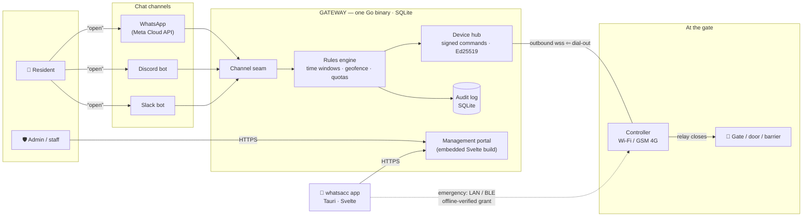
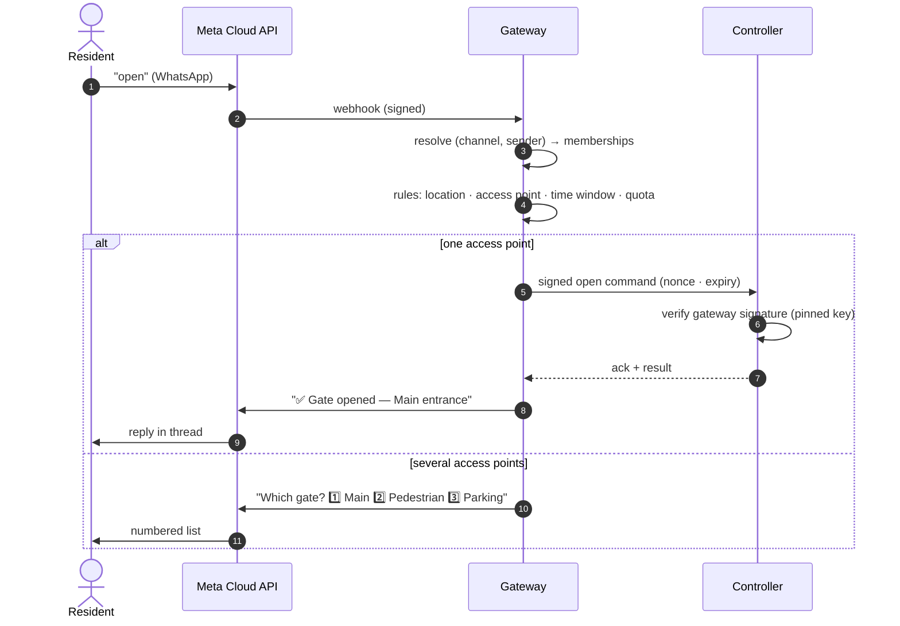
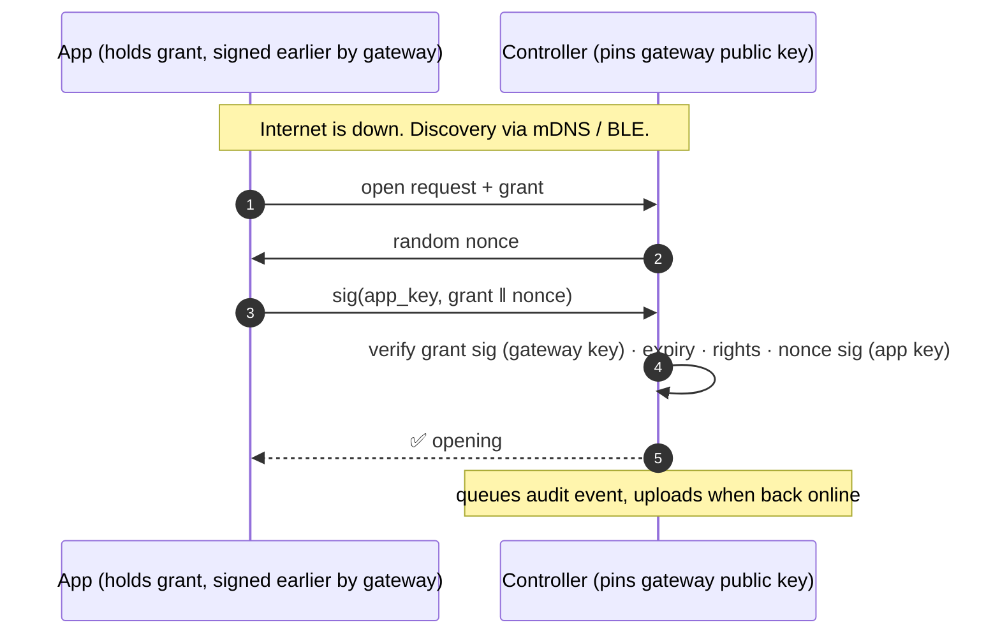

# whatsacc architecture

> **Texts that open gates.** A decentralized access-control system where a chat message —
> WhatsApp, Slack, Discord — opens a physical gate, door or barrier.

whatsacc has no cloud. It is just the **system**: a gateway you run, controllers at
your gates, an app in your pocket — every line MIT-licensed, nothing hosted by us.
[whatsacc.com](https://whatsacc.com) is the project site (docs + downloads), not a
service. There is **no billing system** — nothing in the binary charges anyone
anything; operators who want to charge their residents solve that themselves, outside
the system. Usage tracking (opens, audit, analytics) is a product feature and stays.

---

## 1. The system at a glance



Everything server-side is **one binary**. The gateway receives channel webhooks, runs the
rules, serves the portal and the app's API, holds the audit log, and pushes signed open
commands to controllers. Controllers dial **out** to the gateway, so they work behind
NAT and on CGNAT'd 4G SIMs with zero inbound ports.

---

## 2. Components

| Component      | What it is                                                                | Runs on                              | Stack                          |
| -------------- | ------------------------------------------------------------------------- | ------------------------------------ | ------------------------------ |
| **gateway**    | The entire server: channels, rules, portal, API, device hub, audit | Any VPS / Pi / server with a public URL | Go · SQLite · `go:embed` portal |
| **controller** | The unit wired to the gate relay; verifies signatures, drives the motor    | Pi-class board at the gate, Wi-Fi or GSM | Go agent (+ vendor firmware)  |
| **app**        | Admin console + **emergency access** for residents                         | Desktop, iOS, Android                | Svelte 5 · Tauri v2            |
| **site**       | Marketing landing + docs — static mini-site (house format), fully separate from the app | Any static host · Vulos console sync | static HTML + markdown docs    |
| **proto**      | The versioned wire contracts (see §7)                                      | —                                    | Markdown + schemas             |

### Repo layout

```
whatsacc/
├── backend/      # current API — Cloudflare Workers · Hono · Postgres (spec for the Go port)
├── src/          # current portal + marketing — React 19 · Vite
├── scripts/      # screenshotter (Playwright product shots)
├── site/         # marketing mini-site — hand-written index.html + docs.html + markdown docs (static)
├── proto/        # pairing · signed commands · grants · events contracts
├── gateway/      # 🔨 next: Go, the whole product server
│   └── migrations/   # SQLite schema, clean folded baseline
├── controller/   # 🔨 planned: gate device agent + reference wiring
└── app/          # 🔨 planned: Svelte 5 + Tauri v2 (also builds gateway's embedded portal)
```

---

## 3. The three access paths

People reach the gate in three ways, ranked by how people actually behave:

### 3a. Chat — the primary path

Chat is the product. The gateway exposes a **channel seam**: a small interface that
resolves a sender to an identity, turns a message into an intent, and sends replies.

| Channel      | Identity            | Transport             | Friction to self-host        |
| ------------ | ------------------- | --------------------- | ---------------------------- |
| **WhatsApp** | phone number        | Meta Cloud API webhook | High — needs a verified WABA |
| **Discord**  | user id             | bot gateway / webhook  | Minutes — bot token          |
| **Slack**    | member id           | Events API             | Minutes — app manifest       |

Memberships are keyed on `(channel, external_id)`, not phone-number-only, so one person
can be reachable on several channels.



### 3b. The app — emergency access + admin

The Tauri app is deliberately **not** the daily driver. It exists for two jobs: the
admin console, and opening the gate **when everything else is down**.

The gateway periodically issues each app user an **offline-verifiable grant** — a
short-lived signed statement of their rights (locations, access points, expiry) bound to
the app's own keypair. Near the gate, the app finds the controller directly (mDNS on the
same LAN, or BLE) and proves itself with a challenge-response. No internet, no gateway,
no Meta involved.



Grants are refreshed whenever the app opens with connectivity, so revocation converges
within the grant TTL — and the normal path is online anyway.

### 3c. Web portal — the fallback

Unlimited access through the gateway's web portal, always. Quota warnings in chat
("you have 5 opens left…") point here.

---

## 4. Running a gateway — the WABA insight, reachability, and money

Webhooks are easy; **the WhatsApp number is hard**. A WhatsApp channel needs a verified
Meta Business + WABA + phone number. Every gateway operator brings their own — whatsacc
is never in the loop, and Meta bills the operator directly for their own conversations.

**Reachability is kept deliberately simple.** The gateway binds a listener and serves
HTTPS, full stop — no tunnel protocol, no relay dependency, no driver framework:

1. **Direct** (default) — a VPS or any public IP; the binary does ACME itself.
2. **Any tunnel you already trust** — cloudflared, frp, Tailscale Funnel — run beside
   the binary, forwarding to its port. Documented, not implemented.
3. **Zero-infrastructure mode** — Slack Socket Mode and Discord's bot gateway are
   *outbound* connections, and controllers dial out too. A gateway on a LAN Pi with no
   public URL at all still does Slack + Discord + LAN portal + controllers. Only
   WhatsApp (Meta webhooks) and remote app access need a public URL.

**Money is out of scope.** There is no billing code anywhere in the system. An operator
who wants to charge their residents does it however they like — outside whatsacc.

---

## 5. What "decentralized" means here

Not federation. Not P2P. **Many independent gateways, each a full authority** over its
own tenants, numbers, devices and audit log — with zero coordination between them.

- The app asks "which gateway?" on first run.
- A controller pairs with exactly one gateway and **pins its signing key** — a hostile
  network, DNS hijack, or malicious tunnel cannot forge an open.

## 6. Security model

| Layer            | Mechanism                                                                  |
| ---------------- | -------------------------------------------------------------------------- |
| Command integrity | Ed25519-signed commands: nonce + expiry, controller pins gateway key at pairing |
| Pairing          | Claim-token flow (admin creates claim → device redeems → keys exchanged)    |
| Emergency grants | Short-TTL signed capability bound to app keypair; nonce challenge-response  |
| Channel ingress  | Webhook signature verification per channel (Meta HMAC, Slack signing secret…) |
| Tenancy          | App-layer org scoping in SQLite (replaces Postgres RLS)                     |
| Transport        | TLS terminated by the gateway itself — any tunnel in front only ever sees ciphertext when run in passthrough mode |
| Audit            | Append-only event log: every open, denial, pairing, config change           |
| Abuse limits     | Non-monetary rate limits (open cooldown, hourly caps, chat flood throttle) + optional admin-set per-location quotas; denials audited, chat replies honest |
| Instance admin   | Gateway operator role (one-time claim bootstrap): manage accounts/users, suspend, tune rate-limit defaults, cross-tenant audit view |

## 7. The contracts that must not break (`proto/`)

Deployed hardware is forever. These wire contracts are versioned from day one because
they are painful to retrofit:

1. **Pairing** — claim token redemption, key exchange, gateway-key pinning
2. **Signed commands** — open/close/query, nonce + expiry semantics
3. **Offline grants** — grant format, challenge-response, revocation semantics
4. **Controller events** — upstream direction: button pressed, gate held open, tamper

Binaries can churn; these can only be extended.

## 8. Feature roadmap

Per-location **settings toggles, off by default**:

- **Nearly free** (the audit log already has the data): time & attendance reports,
  who's-on-site / evacuation list, open notifications.
- **Half-built already**: visitor passes (one-time PIN/QR via chat or link — extends
  `temp_access`), recurring access windows (cleaner, Tuesdays 08:00–12:00).
- **Needs controller I/O** (protocol supports now, ship later): gate-held-open alerts,
  visitor button → "someone at the gate, reply OPEN", lockdown mode.
- **Non-goals for v1**: license-plate recognition, multi-party approval, occupancy caps.

## 9. Tech decisions (and what we migrated away from)

| Decision              | Choice                         | Why                                                                 |
| --------------------- | ------------------------------ | ------------------------------------------------------------------- |
| Gateway language      | **Go** (was Deno/TS)           | Single small static binary, ARM-friendly, `go:embed` portal        |
| Database              | **SQLite** (was Neon Postgres + RLS) | Zero-dependency self-hosting; one file to back up; RLS existed for shared-cloud tenancy we no longer have |
| Frontend              | **Svelte 5** (was React 19)    | One codebase → embedded portal + Tauri desktop/mobile; small output |
| Apps                  | **Tauri v2**                   | Desktop + iOS + Android from the Svelte codebase                    |
| Billing               | **None**                       | Out of scope by design — operators charge their residents outside the system if they want to |
| License               | **MIT, everything**            | The whole system is open — there is nothing else                    |

## 10. Migration path from the current codebase

The Cloudflare Workers/Hono backend (~2.9k lines of routes) is the **spec**: auth,
locations, access rules, devices/pairing and WhatsApp flows port to Go nearly
mechanically. The folded Postgres migrations map to a clean SQLite baseline. The React
landing/docs carry their brand (Fraunces/Inter/JetBrains Mono, ink-on-paper, arch
motif) into `site/` and `app/`. The vitest suite's cases (unit, integration,
security, contract) are ported alongside the routes they cover.
