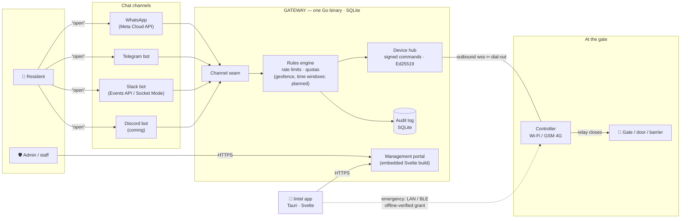
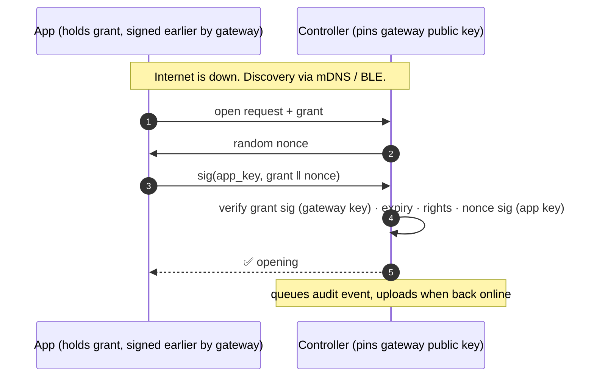

# lintel architecture

> **Texts that open gates.** A decentralized access-control system where a chat message —
> WhatsApp, Slack, Telegram, Discord soon — opens a physical gate, door or barrier.

lintel has no cloud. It is just the **system**: a gateway you run, controllers at
your gates, an app in your pocket — every line MIT-licensed, nothing hosted by us.
[vulos.org/products/lintel](https://vulos.org/products/lintel) is the project site
(docs + downloads), not a service. There is **no billing system** — nothing in the binary charges anyone
anything; operators who want to charge their residents solve that themselves, outside
the system. Usage tracking (opens, audit, analytics) is a product feature and stays.

---

## 1. The system at a glance



Everything server-side is **one binary**. The gateway receives channel webhooks, runs the
rules, serves the portal and the app's API, holds the audit log, and pushes signed open
commands to controllers. Controllers dial **out** to the gateway, so they work behind
NAT and on CGNAT'd 4G SIMs with zero inbound ports.

---

## 2. Components

| Component      | What it is                                                                | Runs on                              | Stack                          |
| -------------- | ------------------------------------------------------------------------- | ------------------------------------ | ------------------------------ |
| **gateway**    | The entire server: channels, rules, portal, API, device hub, audit — runs the product core today | Any VPS / Pi / server with a public URL | Go · SQLite · `go:embed` portal |
| **controller** | The unit wired to the gate relay; verifies signatures, drives the motor. Reference agent is real and conformance-tested; GPIO relay + BLE radio are the hardware-only surfaces still stubbed | Pi-class board at the gate, Wi-Fi or GSM | Go agent, own module (`-tags gpio`/`-tags ble` for hardware) |
| **e2e**        | Cross-module harness: boots real gateway + controller binaries and proves the money path over the wire | CI, dev machine | Go, subprocess-driven |
| **app**        | Admin console + **emergency access** for residents. Ships today as `src/` + `src-tauri/` (gateway picker included); a Svelte 5 rewrite is a longer-term target, not started | Desktop, iOS, Android                | React 19 · Tauri v2 (target: Svelte 5) |
| **site**       | Marketing landing + docs — static mini-site (house format), fully separate from the app | Any static host · Vulos console sync | static HTML + markdown docs    |
| **proto**      | The versioned wire contracts (see §7)                                      | —                                    | Markdown + schemas             |

### Repo layout

```
lintel/
├── backend/      # Cloudflare Workers · Hono · Postgres — behavioural reference the gateway ports from,
│                 # still ahead on: phone-OTP verify, analytics, OAuth/email-verify/password-reset, meters
├── src/          # current portal + marketing — React 19 · Vite (wrapped by src-tauri/ for desktop)
├── src-tauri/    # Tauri v2 desktop shell — gateway picker, wraps src/
├── scripts/      # screenshotter (Playwright product shots)
├── site/         # marketing mini-site — hand-written index.html + docs.html + markdown docs (static)
├── proto/        # pairing · signed commands · grants · events contracts (+ vectors/ conformance fixtures)
├── gateway/      # 🟢 shipped: Go, the whole product server (auth, rules, hub, admin, channels)
│   └── migrations/   # SQLite schema, clean folded baseline
├── controller/   # 🟢 shipped: reference gate device agent (own Go module); GPIO/BLE need real hardware
├── e2e/          # 🟢 shipped: cross-module suite, real gateway+controller binaries over the wire
└── app/          # 🔨 not started: a dedicated Svelte 5 rewrite (today's app is src/ + src-tauri/)
```

---

## 3. The three access paths

People reach the gate in three ways, ranked by how people actually behave:

### 3a. Chat — the primary path

Chat is the product. The gateway exposes a **channel seam**: a small interface that
resolves a sender to an identity, turns a message into an intent, and sends replies.

| Channel      | Identity            | Transport             | Friction to self-host        |
| ------------ | ------------------- | --------------------- | ---------------------------- |
| **WhatsApp** | phone number        | Meta Cloud API webhook | High — needs a verified WABA |
| **Slack**    | member id           | Events API webhook, or Socket Mode (outbound WSS, zero ingress) | Minutes — app manifest |
| **Telegram** | chat id             | Webhook today (opens fully wired); long-polling on the roadmap | Minutes — BotFather token |
| **Discord**  | user id             | bot gateway / webhook — **coming, not built** | Minutes — bot token          |

Memberships are keyed on `(channel, external_id)`, not phone-number-only, so one person
can be reachable on several channels.


### 3b. The app — emergency access + admin

The Tauri app is deliberately **not** the daily driver. It exists for two jobs: the
admin console, and opening the gate **when everything else is down**.

The gateway periodically issues each app user an **offline-verifiable grant** — a
short-lived signed statement of their rights (locations, access points, expiry) bound to
the app's own keypair. Near the gate, the app finds the controller directly (mDNS on the
same LAN, or BLE) and proves itself with a challenge-response. No internet, no gateway,
no Meta involved.

**Status:** the wire contract, the controller-side verification, and the gateway's
issuance endpoint (`POST /v1/offline-grants`) are all real and conformance-tested
against `proto/vectors/`. The app side — requesting, storing and presenting a grant —
is not built yet, so this path does not run end-to-end for a real resident today; see
[Emergency access](site/docs/emergency-access.md) for the full status.



Grants are refreshed whenever the app opens with connectivity, so revocation converges
within the grant TTL — and the normal path is online anyway.

### 3c. Web portal — the fallback

Unlimited access through the gateway's web portal, always. Quota warnings in chat
("you have 5 opens left…") point here.

---

## 4. Running a gateway — the WABA insight, reachability, and money

Webhooks are easy; **the WhatsApp number is hard**. A WhatsApp channel needs a verified
Meta Business + WABA + phone number. Every gateway operator brings their own — lintel
is never in the loop, and Meta bills the operator directly for their own conversations.

**Reachability is kept deliberately simple.** The gateway binds a listener and serves
**plain HTTP, full stop** — no TLS/ACME code, no tunnel protocol, no relay dependency,
no driver framework. TLS is entirely the operator's job: put a reverse proxy or a
TLS-terminating tunnel in front of the gateway for anything reachable beyond
`localhost` — see [`site/docs/ingress.md`](site/docs/ingress.md) for a working Caddy
example. WhatsApp is the reason a public endpoint is ever needed at all: the Meta
Cloud API is **webhook-only** (Meta calls out to you; there is no long-poll
alternative), so a WhatsApp channel always needs a public HTTPS URL Meta can reach.

1. **Direct** — a VPS or any public IP, behind your own reverse proxy (Caddy, nginx,
   Traefik) or a TLS-terminating tunnel that holds the certificate. The gateway binary
   itself has zero TLS/ACME code.
2. **Any tunnel you already trust** — cloudflared, Tailscale Funnel, ngrok, or a
   self-hosted `vulos-relayd` (open-source, no Vulos account needed) — run beside the
   binary, forwarding to its port; these terminate TLS at their own edge or local agent
   and hand the gateway plain HTTP, so no extra proxy is needed. A tunnel run in raw
   TCP/SNI-passthrough mode (e.g. `frp` TCP passthrough) doesn't work against the
   gateway directly, since it has nothing to terminate that TLS with — put a reverse
   proxy behind a passthrough tunnel if you want that shape. The paid, hosted
   **Vulos Relay** is the same tunnel model as a convenience, never a requirement — one
   feature-scoped ingress option among several, not a dependency.
3. **Zero-infrastructure mode** — real today for Slack. **Slack Socket Mode ships**:
   set an app-level token and the gateway dials **out** to Slack over a single
   WebSocket, no inbound port or URL needed. Telegram long-polling (the same idea for
   that channel) is on the roadmap — today Telegram uses a webhook, so it still needs
   a reachable URL. Controllers dial out unconditionally. A gateway on a LAN Pi with no
   public URL at all already does Slack + LAN portal + controllers end to end. Only
   WhatsApp (Meta webhooks), Telegram (until long-polling lands) and remote app access
   need a public URL.

Full option-by-option breakdown, including the WhatsApp-is-webhook-only reasoning and
which channels need zero ingress today: [`site/docs/ingress.md`](site/docs/ingress.md).

**Money is out of scope.** There is no billing code anywhere in the system. An operator
who wants to charge their residents does it however they like — outside lintel.

---

## 5. What "decentralized" means here

Not federation. Not P2P. **Many independent gateways, each a full authority** over its
own tenants, numbers, devices and audit log — with zero coordination between them.

- The app asks "which gateway?" on first run.
- A controller pairs with exactly one gateway and **pins its signing key** — a hostile
  network, DNS hijack, or malicious tunnel cannot forge an open.

## 6. Security model

| Layer            | Mechanism                                                                  |
| ---------------- | -------------------------------------------------------------------------- |
| Command integrity | Ed25519-signed commands: nonce + expiry, controller pins gateway key at pairing |
| Pairing          | Claim-token flow (admin creates claim → device redeems → keys exchanged)    |
| Emergency grants | Short-TTL signed capability bound to app keypair; nonce challenge-response  |
| Channel ingress  | Per-channel verification (Meta HMAC, Slack signed-request scheme + replay window, Telegram secret-token header) |
| Tenancy          | App-layer org scoping in SQLite (replaces Postgres RLS)                     |
| Transport        | Plain HTTP — the gateway ships no TLS/ACME code; TLS comes from a reverse proxy or TLS-terminating tunnel the operator puts in front (see §4) |
| Audit            | Append-only event log: every open, denial, pairing, config change           |
| Abuse limits     | Non-monetary rate limits (open cooldown, hourly caps, chat flood throttle) + optional admin-set per-location quotas; denials audited, chat replies honest |
| Instance admin   | Gateway operator role (one-time claim bootstrap): manage accounts/users, suspend, tune rate-limit defaults, cross-tenant audit view |

## 7. The contracts that must not break (`proto/`)

Deployed hardware is forever. These wire contracts are versioned from day one because
they are painful to retrofit:

1. **Pairing** — claim token redemption, key exchange, gateway-key pinning
2. **Signed commands** — open/close/query, nonce + expiry semantics
3. **Offline grants** — grant format, challenge-response, revocation semantics
4. **Controller events** — upstream direction: button pressed, gate held open, tamper

Binaries can churn; these can only be extended.

## 8. Feature roadmap

Per-location **settings toggles, off by default**:

- **Nearly free** (the audit log already has the data): time & attendance reports,
  who's-on-site / evacuation list, open notifications.
- **Shipped**: temporary/visitor access grants — a phone number gets access to named
  access points for a one-off dated window, with an optional use cap, revocable, and
  refunded on a rate-limit/quota denial (`POST/GET /v1/grants`, portal page). This is
  the "contractor for one Saturday" case.
- **Designed, not started**: one-time PIN/QR passes that don't require knowing the
  visitor's number in advance, and *recurring* access windows — a schedule that repeats
  (cleaner, every Tuesday 08:00–12:00) rather than a single dated window.
- **Needs controller I/O** (protocol supports now, ship later): gate-held-open alerts,
  visitor button → "someone at the gate, reply OPEN", lockdown mode.
- **Non-goals for v1**: license-plate recognition, multi-party approval, occupancy caps.
- **Research idea, not committed**: a **DMTAP channel adapter**, behind the same
  `internal/channels/` seam every other channel implements — "send a signed DMTAP
  message → gate opens." Unlike every channel above, it would depend on nobody: no
  Meta, no Slack workspace, no BotFather token, no phone number at all — just a
  keypair and a DMTAP-speaking counterparty, verified the same way controller commands
  already are (signature, not a third party's account system). It would also stretch
  what a "visitor" can be granted access as: today grants resolve to an E.164 number or
  a channel member id; a DMTAP identity resolves to a raw key or a `name@domain`, so a
  visitor pass could be issued to either without a phone number or a chat account of
  any kind. A `DialChannel` scaffold and a `DMTAPTransport` interface now exist
  (`gateway/internal/channels/dmtap.go`), matching the shape every other channel
  implements — but there is exactly one implementation of that interface,
  `NotImplementedTransport`, which always fails closed, so the channel does not run in
  the shipped binary. No working transport, no wire format for turning a DMTAP message
  into a gate command, no schedule.


## 9. Tech decisions (and what we migrated away from)

| Decision              | Choice                         | Why                                                                 |
| --------------------- | ------------------------------ | ------------------------------------------------------------------- |
| Gateway language      | **Go** (was Deno/TS)           | Single small static binary, ARM-friendly, `go:embed` portal        |
| Database              | **SQLite** (was Neon Postgres + RLS) | Zero-dependency self-hosting; one file to back up; RLS existed for shared-cloud tenancy we no longer have |
| Frontend              | **Svelte 5** (target; today's shipped app is still React 19) | One codebase → embedded portal + Tauri desktop/mobile; small output |
| Apps                  | **Tauri v2**                   | Desktop + iOS + Android; the desktop shell (gateway picker) ships today wrapping the current React codebase |
| Billing               | **None**                       | Out of scope by design — operators charge their residents outside the system if they want to |
| License               | **MIT, everything**            | The whole system is open — there is nothing else                    |

## 10. Migration path from the current codebase

The Cloudflare Workers/Hono backend (~2.9k lines of routes) was the **spec**, and the
port is substantially done: auth, locations, access rules, controller pairing/hub and
the WhatsApp/Slack/Telegram flows now run natively in the Go gateway, on a clean folded
SQLite baseline (no Postgres, no RLS — tenancy is app-layer). What the backend still
does that the gateway defers: phone-OTP verify, analytics endpoints, Google
OAuth/email-verify/password-reset, meters, and the real portal bundle (the gateway
embeds a placeholder behind `-tags portal` today). The React landing/docs brand
(Fraunces/Inter/JetBrains Mono, ink-on-paper, arch motif) already lives in `site/`; a
dedicated `app/` (Svelte 5) has not been started — the desktop app today is `src/` +
`src-tauri/` (React 19 + Tauri v2), which already ships a gateway picker so one build
can point at any gateway. The backend's test suite (unit, integration, security,
contract) is the reference the gateway's own Go tests, plus the cross-module `e2e/`
harness, were built against.
