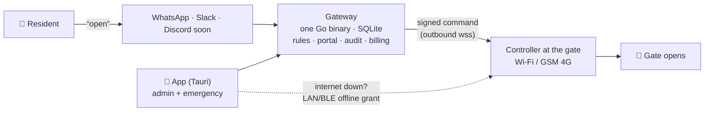

<div align="center">


# whatsacc

**Texts that open gates.**

Open physical gates, doors and barriers from the chat apps people already use —
WhatsApp first, Slack today, Discord soon. Geofenced, audited, built for trust.

[](LICENSE)
[](ARCHITECTURE.md)
[](https://vulos.org)

<picture>
  <source media="(prefers-color-scheme: dark)" srcset="web/screenshots/dark/portal-dashboard.png" />
  
</picture>

</div>

---

There is **no cloud center**. whatsacc is a decentralized network of independent
**gateways**: a gateway is one MIT-licensed Go binary (SQLite inside, management portal
embedded) that anyone can run — a VPS, a Pi in the guardhouse, anywhere with a public
URL. whatsacc runs the flagship hosted gateway at [whatsacc.com](https://whatsacc.com)
with free and paid tiers; the same binary, billing included, lets **you** run your own —
even a paid one with your own tiers and keys.



## Three ways in

Ranked by how people actually behave:

1. **Chat** — text `open` to the gateway's number or bot. The rules engine checks
   identity, location, access point, time windows and quotas, then pushes an
   Ed25519-signed command to the controller. Multiple access points? You get a
   numbered picker in the thread.
2. **The app** — emergency access that works **when the internet is down**: the gateway
   pre-issues short-lived signed grants; the app proves them to the controller directly
   over LAN/BLE with a nonce challenge. Also the admin console.
3. **Web portal** — unlimited fallback, always.

The full design — components, security model, wire contracts, hosted-vs-self-hosted
economics — lives in **[ARCHITECTURE.md](ARCHITECTURE.md)**. The wire contracts that
controllers and apps depend on are versioned in [`proto/`](proto/).

## A look around

| Access points & controllers | Analytics |
| :---: | :---: |
| <picture><source media="(prefers-color-scheme: dark)" srcset="web/screenshots/dark/portal-locations.png" /></picture> | <picture><source media="(prefers-color-scheme: dark)" srcset="web/screenshots/dark/portal-analytics.png" /></picture> |

| Tap-to-open (mobile) | Landing |
| :---: | :---: |
| <picture><source media="(prefers-color-scheme: dark)" srcset="web/screenshots/dark/app-emergency.png" /></picture> | <picture><source media="(prefers-color-scheme: dark)" srcset="web/screenshots/dark/landing-hero.png" /></picture> |

Every screenshot above is generated, not hand-made — light **and** dark, from the real
app with realistic data:

```bash
npm run screenshotter   # boots the app with mocked data → web/screenshots/{,dark/}
```

## Monorepo

| Directory     | What                                                             | Status |
| ------------- | ---------------------------------------------------------------- | ------ |
| `web/`        | [whatsacc.com](https://whatsacc.com) — landing + 13-chapter docs, self-contained, light/dark | ✅ |
| `proto/`      | Versioned wire contracts: pairing, signed commands, offline grants, events, tunnel | ✅ v0 draft |
| `backend/`    | Current API — Cloudflare Workers · Postgres RLS · Paystack · WhatsApp + Slack | ✅ running, **spec for the Go port** |
| `src/`        | Current portal + marketing — React 19 · Vite · light/dark        | ✅ running |
| `scripts/`    | `screenshotter` — Playwright product shots with fixture data     | ✅ |
| `gateway/`    | Go single-binary gateway (SQLite, embedded portal, channel seam) | 🔨 next |
| `controller/` | Gate device agent + reference wiring                             | 🔨 planned |
| `app/`        | Svelte 5 + Tauri v2 — admin console + offline emergency access   | 🔨 planned |

The running stack is the behavioral reference: its routes, tenancy semantics, chat
flows and test suites define what the Go gateway must do.

## Quickstart (current stack)

Prereqs: Node 20+, Postgres 16+ (local).

```bash
npm install                     # frontend deps
cd backend && npm install       # backend deps

npm run migrate                 # apply migrations (DATABASE_URL in ../.env)
npm run dev                     # API via wrangler on :8787
cd .. && npm run dev            # Vite portal on :5173
```

Tests, from `backend/`:

```bash
npm run check                   # tsc
npm run test:unit               # pure unit tests, no DB
npm run test:integration        # real local Postgres — TRUNCATEs tables, use a throwaway DB
npm run test:security           # authz / RLS / webhook-signature suites
npm run test:contract           # opt-in: real Paystack/Resend test APIs when keys are set
```

Contract suites skip cleanly without keys, refuse to run against live Paystack keys,
and leave artifacts in test dashboards — see [`web/docs/`](web/docs/) for details.

## Docs

The full documentation ships in this repo at [`web/docs/`](web/docs/) — getting
started, linking WhatsApp, running your own gateway, channels, billing and running a
*paid* gateway, controllers and pairing, offline emergency access, security model, API
reference, troubleshooting. Served at
[whatsacc.com/docs](https://whatsacc.com/docs) and inside the
[Vulos console](https://vulos.org/products/whatsacc/docs).

## Part of the Vulos suite

whatsacc is a standalone open-source product in the [Vulos](https://vulos.org) suite —
sovereign software you can run yourself. It composes with
[vulos-relay](https://vulos.org/products/relay) for one-line reachability when your
gateway lives behind NAT, but never requires it: any tunnel (cloudflared, frp) or a
plain public IP works.

## License

[MIT](LICENSE) — all of it: gateway, portal, app, controller agent, billing. The moat
is running the best flagship, not hiding code.
