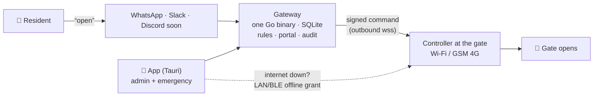
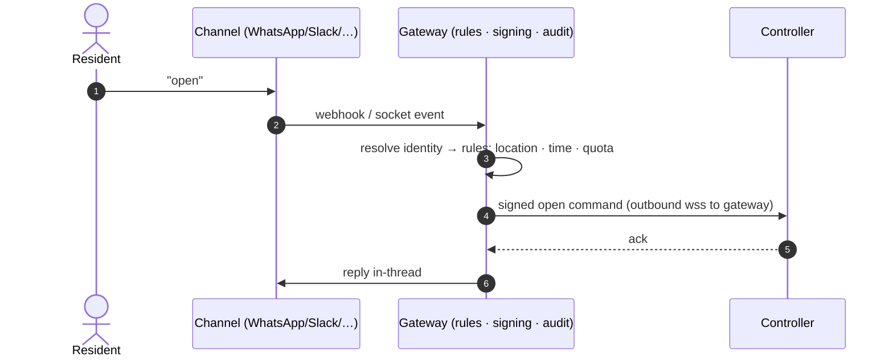

<div align="center">


# whatsacc

**Texts that open gates.**

Open physical gates, doors and barriers from the chat apps people already use —
WhatsApp, Slack (incl. Socket Mode) and Telegram today, Discord soon. Geofenced,
audited, built for trust.

[](LICENSE)
[](ARCHITECTURE.md)
[](https://vulos.org)

<sub>Part of the <strong><a href="https://vulos.org">VulOS</a></strong> open-source family — see [Part of VulOS](#part-of-vulos) below for exactly how.</sub>

<picture>
  <source media="(prefers-color-scheme: dark)" srcset="site/screenshots/dark/portal-dashboard.png" />
  
</picture>

</div>

---

## What is whatsacc?

whatsacc is a decentralized network of independent **gateways**: a gateway is one
MIT-licensed Go binary (SQLite inside, management portal embedded) that anyone can
run — a VPS, a Pi in the guardhouse, anywhere with a public URL. There is **no cloud
center, no hosted service and no billing system** — whatsacc.com is the project site,
not a cloud. You bring your own WhatsApp number or Slack workspace; Meta bills you
directly for your own conversations. Operators who want to charge their residents
solve that outside the system.



**The resilience story:** the app's emergency path works with **no internet at all** —
the gateway pre-issues short-lived signed grants, and the app proves them straight to
the controller over LAN or Bluetooth, no gateway and no Meta involved. This is not a
fallback bolted on after the fact; it's a first-class access path, tested and
documented in [Emergency access](site/docs/emergency-access.md).

## Part of VulOS

**Vulos = free, open-source software + two paid services.** The Vulos OS, all its
apps, and the app store are OSS and free — you self-host them on a box you provision
and pay for yourself; Vulos bills only for **Vulos Relay** (reachability) and **backup
storage**. There is no compute, mail, or app-store billing.

The suite: **Vulos OS** (the web-native desktop shell) · **Vulos Office** (docs,
sheets, slides, PDF, whiteboards) · **Vulos Files** · **Vulos Relay** · **llmux**
(sovereign AI gateway) — with mail/calendar/contacts as bring-your-own via
**lilmail**, and chat/video over established third-party protocols (Matrix/Element,
Jitsi).

whatsacc is **not** one of those apps, and it isn't hosted inside the Vulos OS shell —
it's a sibling open-source product under the same [`github.com/vul-os`](https://github.com/vul-os)
family, solving a different problem (physical access control) with the same values:
standalone-first, MIT everything, no hard dependency on anything else in the family.
The one real touchpoint is optional: when a self-hosted gateway needs a public
endpoint for its WhatsApp channel, **Vulos Relay** is one convenient tunnel option
among several (alongside cloudflared, frp, or a self-hosted `vulos-relayd` — see
[Ingress & reachability](site/docs/ingress.md)) — never a requirement. whatsacc runs
to completion with nothing but a box.

## Features

Three ways in, ranked by how people actually behave:

1. **Chat** — text `open` to the gateway's number or bot. The rules engine checks
   identity, location, access point, time windows and quotas, then pushes an
   Ed25519-signed command to the controller. Multiple access points? You get a
   numbered picker in the thread.
2. **The app** — emergency access that works **when the internet is down**: the gateway
   pre-issues short-lived signed grants; the app proves them to the controller directly
   over LAN/BLE with a nonce challenge. Also the admin console.
3. **Web portal** — unlimited fallback, always.

Plus: geofencing, per-location time windows and quotas, an append-only audit log,
Ed25519-signed device commands, claim-token controller pairing, and an
instance-admin seat for operators. The full design — components, security model, wire
contracts, hosted-vs-self-hosted economics — lives in
**[ARCHITECTURE.md](ARCHITECTURE.md)**. The wire contracts that controllers and apps
depend on are versioned in [`proto/`](proto/).

## Screenshots

| Access points & controllers | Analytics |
| :---: | :---: |
| <picture><source media="(prefers-color-scheme: dark)" srcset="site/screenshots/dark/portal-locations.png" /></picture> | <picture><source media="(prefers-color-scheme: dark)" srcset="site/screenshots/dark/portal-analytics.png" /></picture> |

| Tap-to-open (mobile) | Landing |
| :---: | :---: |
| <picture><source media="(prefers-color-scheme: dark)" srcset="site/screenshots/dark/app-emergency.png" /></picture> | <picture><source media="(prefers-color-scheme: dark)" srcset="site/screenshots/dark/landing-hero.png" /></picture> |

Every screenshot above is generated, not hand-made — light **and** dark, from the real
app with realistic data:

```bash
npm run screenshotter   # boots the app with mocked data → site/screenshots/{,dark/}
```

## Quick start (standalone)

whatsacc runs entirely on your own machine — nothing to sign up for, no shared cloud,
no Vulos account required. Prereqs: Node 20+, Postgres 16+ (local).

```bash
git clone https://github.com/vul-os/whatsacc && cd whatsacc

npm install                     # frontend deps
cd backend && npm install       # backend deps
cd ..

cp .env.example .env            # read by migrate/seed/test scripts (node --env-file)
cp backend/.dev.vars.example backend/.dev.vars   # read by `wrangler dev` (NOT .env)
# → set DATABASE_URL + JWT_SECRET in BOTH; everything else is optional

cd backend
npm run migrate                 # apply migrations (DATABASE_URL from ../.env)
npm run dev                     # API via wrangler on :8787 (env from .dev.vars)
cd .. && npm run dev            # Vite portal on :5173
```

That's the whole install — no chat channel is required to run the portal and explore
it. Attaching WhatsApp or Slack (bring your own number/workspace, Meta/Slack bill you
directly) is covered in [Run a gateway](site/docs/self-host.md) and
[Chat channels](site/docs/channels.md) once you're ready to open a real gate.

Tests, from `backend/`:

```bash
npm run check                   # tsc
npm run test:unit               # pure unit tests, no DB
npm run test:integration        # real local Postgres — TRUNCATEs tables, use a throwaway DB
npm run test:security           # authz / RLS / webhook-signature suites
npm run test:contract           # opt-in: real Resend test API when keys are set
```

Contract suites skip cleanly without keys — see [`site/docs/`](site/docs/) for details.

## How it works

Everything server-side is **one binary**. The **Go gateway** in `gateway/` is that
binary and now runs the product core — auth, accounts, locations, access points,
controller pairing + the WebSocket device hub, the Ed25519-signed open path, admin
console, rate limits, and the WhatsApp / Slack (Events API + Socket Mode) / Telegram
channels — on one Go binary with one SQLite file. The mature Cloudflare Workers backend
in `backend/` is the behavioural reference it was ported from (and still ahead on a few
deferred surfaces: OTP verify, analytics, OAuth, meters). The gateway receives channel
webhooks, runs the rules, serves the portal and the app's API, holds the audit log, and
pushes signed open commands to controllers. Controllers dial **out** to the gateway, so
they work behind NAT and on CGNAT'd 4G SIMs with zero inbound ports.



The full component breakdown, security model and the "decentralized, not federated"
philosophy are in **[ARCHITECTURE.md](ARCHITECTURE.md)**.

## Configuration

Configuration is environment variables — `.env` / `.env.example` at the repo root for
the current stack, `backend/.dev.vars.example` for the Workers dev server. The Go
gateway's target configuration (data directory, per-channel credentials, rate-limit
tuning, admin claim token) is documented in
[Run a gateway → Configuration](site/docs/self-host.md#configuration).

## Documentation

| Doc | What |
| --- | --- |
| [Getting started](site/docs/getting-started.md) | Fastest path to your first opened gate |
| [Run a gateway](site/docs/self-host.md) | Full self-host walkthrough, install, backup/restore |
| [Ingress & reachability](site/docs/ingress.md) | Which channels need a public URL, and the honest options if yours does |
| [Chat channels](site/docs/channels.md) | WhatsApp, Slack (Events API + Socket Mode), Telegram, Discord (coming) |
| [Controllers](site/docs/controllers.md) | Wiring a gate device |
| [Emergency access](site/docs/emergency-access.md) | The offline LAN/BLE grant path |
| [Architecture](site/docs/architecture.md) · [ARCHITECTURE.md](ARCHITECTURE.md) | Full system design |
| [Security](site/docs/security.md) · [SECURITY.md](SECURITY.md) | Security model + disclosure |
| [API reference](site/docs/api.md) | HTTP surface |

The full set ships in this repo at [`site/docs/`](site/docs/) — `site/` is a plain
static site, host it anywhere; it also syncs into the
[Vulos console](https://vulos.org/products/whatsacc/docs) as the product mini-site.

## Development

| Directory     | What                                                             | Status |
| ------------- | ---------------------------------------------------------------- | ------ |
| `site/`       | Landing + docs — house mini-site format, self-contained, light/dark | ✅ |
| `proto/`      | Versioned wire contracts: pairing, signed commands, offline grants, events | ✅ v0 draft |
| `backend/`    | Current API — Cloudflare Workers · Postgres RLS · WhatsApp + Slack | ✅ running, **spec for the Go port** |
| `src/`        | Portal application — React 19 · Vite · light/dark, wrapped as a desktop app by `src-tauri/` (Tauri desktop shell, in progress) | ✅ running |
| `scripts/`    | `screenshotter` — Playwright product shots with fixture data     | ✅ |
| `gateway/`    | Go single-binary gateway — SQLite, auth core, admin claim, signed envelopes, WhatsApp/Slack/Telegram channels, admin console | 🟢 runs the product core |
| `controller/` | Gate device agent — pairing, key pinning, signed-command verification, offline LAN/BLE grants | 🟢 reference impl real; GPIO relay + BLE radio need real hardware (`-tags gpio` / `-tags ble`) |
| `e2e/`        | Cross-module suite — real gateway + controller binaries over the wire, money path proven | 🟢 |
| `src-tauri/`  | Tauri v2 desktop shell wrapping `src/` — gateway picker (any gateway, not build-time-fixed) | 🟢 |
| `app/`        | A dedicated Svelte 5 rewrite of the app — today's desktop app is `src/` + `src-tauri/` (React 19) instead | 🔨 not started, not needed short-term |

The running Workers stack is the behavioral reference: its routes, tenancy semantics,
chat flows and test suites define what the Go gateway must do. Build/test commands per
directory: see the test block under [Quick start](#quick-start-standalone) for
`backend/`, `cd gateway && make check` (or `go test ./...`) for the Go gateway,
`cd controller && go build ./...` for the controller agent, and `cd e2e && go test ./...`
for the cross-module harness.

Dev setup, test suites and style live in [CONTRIBUTING.md](CONTRIBUTING.md).

## Contributing & security

Small, focused PRs against `main` — see [CONTRIBUTING.md](CONTRIBUTING.md).
Vulnerabilities — this product opens physical gates — go privately via
[SECURITY.md](SECURITY.md), never the public tracker.

## License

[MIT](LICENSE) — all of it: gateway, portal, app, controller agent. No cloud, no
billing system, no paid features. Just the system.
