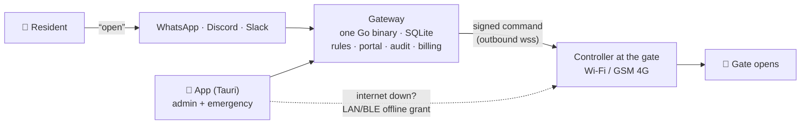

# whatsacc

> **Texts that open gates.**

whatsacc opens physical gates, doors and barriers from the chat apps people already use —
WhatsApp first, Discord and Slack next. Geofenced, audited, and built for trust.

There is **no cloud center**. whatsacc is a decentralized network of independent
**gateways**: a gateway is one MIT-licensed Go binary (SQLite inside, management portal
embedded) that anyone can run — on a VPS, a Pi, anywhere with a public URL. whatsacc runs
the flagship hosted gateway at [whatsacc.com](https://whatsacc.com) with a free tier and
paid tiers; the same binary, billing included, lets **you** run your own — even a paid one
with your own tiers and keys.



Three ways in, ranked by how people actually behave:

1. **Chat** — text `open` to the gateway's number/bot. The rules engine checks identity,
   location, access point, time windows and quotas, then pushes an Ed25519-signed command
   to the controller.
2. **The app** — emergency access that works **when the internet is down**: the gateway
   pre-issues short-lived signed grants; the app proves them to the controller directly
   over LAN/BLE with a nonce challenge. Also the admin console.
3. **Web portal** — unlimited fallback, always.

Read the full design — components, security model, wire contracts, hosted-vs-self-hosted
economics — in **[ARCHITECTURE.md](ARCHITECTURE.md)**.

## Monorepo

| Directory     | What                                                            | Status |
| ------------- | --------------------------------------------------------------- | ------ |
| `web/`        | whatsacc.com — landing + docs (static, self-contained)          | ✅ new |
| `gateway/`    | Go: the whole server — channels, rules, portal, device hub, billing | 🔨 being ported from `backend/` |
| `controller/` | Gate device agent + reference wiring                            | 🔨 planned |
| `app/`        | Svelte 5 + Tauri v2 — admin console + emergency access          | 🔨 planned |
| `proto/`      | Versioned wire contracts: pairing, signed commands, grants      | 🔨 planned |
| `backend/`    | Legacy Deno/Hono/Postgres implementation — **the spec** for the Go port | ⚠️ legacy |
| `src/`        | Legacy React 19 frontend (brand + copy source)                  | ⚠️ legacy |

The legacy stack still runs (see below) and is the behavioral reference: its routes,
RLS-tenancy semantics, WhatsApp flows and test suites define what the Go gateway must do.

## Screenshots

Product screenshots used across the landing page and docs are generated, not hand-made:

```bash
npm run screenshotter   # boots the app with mocked data, captures web/screenshots/{,dark/}
```

## Running the legacy stack (current reference implementation)

Prereqs: Node 20+, Deno 1.46+, Postgres 16+.

```bash
npm install                # frontend deps
cd backend
deno task migrate          # apply migrations (DATABASE_URL in ../.env)
deno task dev              # API on :8000
cd .. && npm run dev       # Vite on :5173
```

Tests (from `backend/`): `deno task test:unit`, `deno task test:integration`,
`deno task test:security`, and opt-in `deno task test:contract` suites that hit real
Paystack/Resend test APIs when keys are present — see the docs for side effects.

## Part of the Vulos suite

whatsacc is a standalone open-source product in the [Vulos](https://vulos.org) suite —
sovereign software you can run yourself. It composes with
[vulos-relay](https://vulos.org/products/relay) for one-line reachability when your
gateway lives behind NAT, but never requires it.

## License

MIT — all of it: gateway, portal, app, controller agent, billing. The moat is running
the best flagship, not hiding code.
