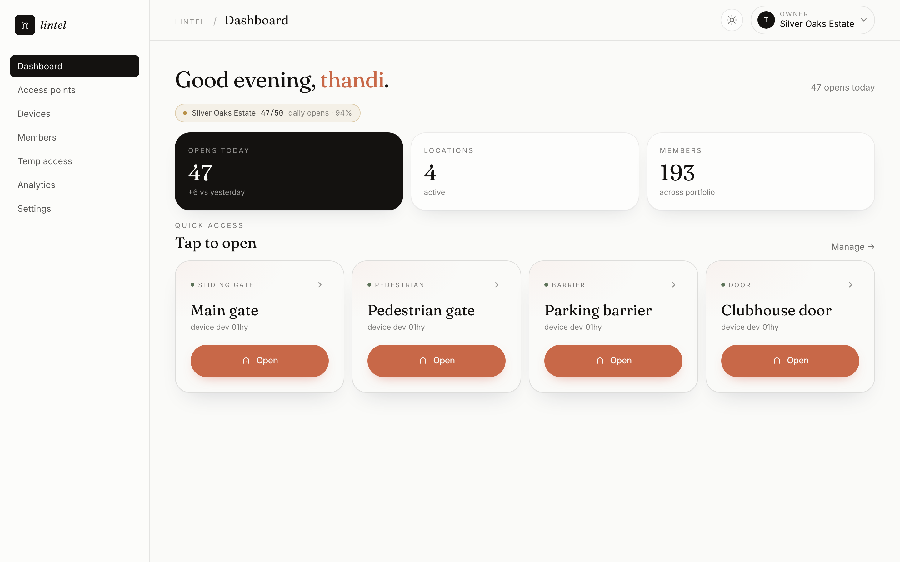
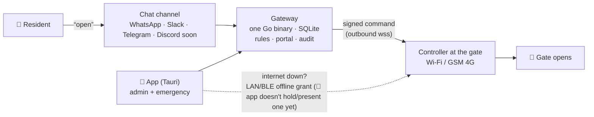
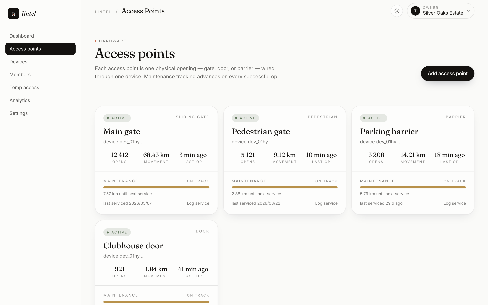
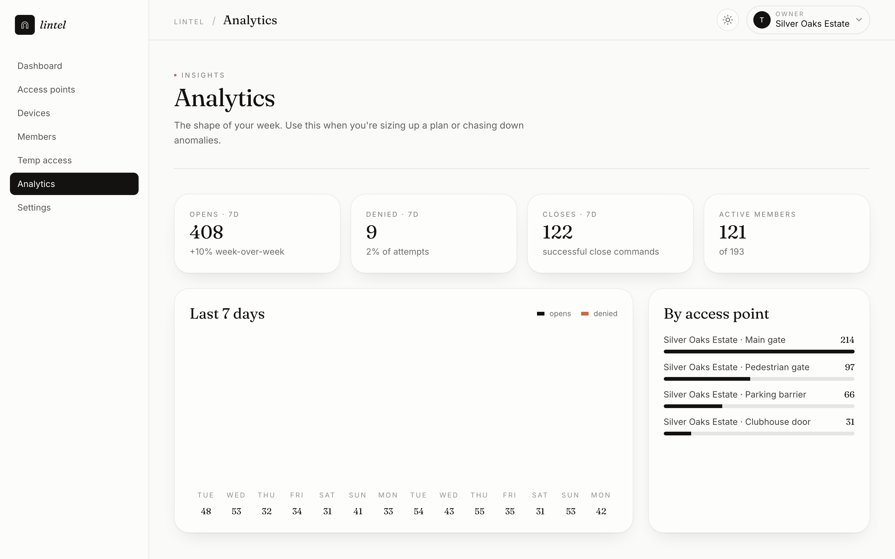
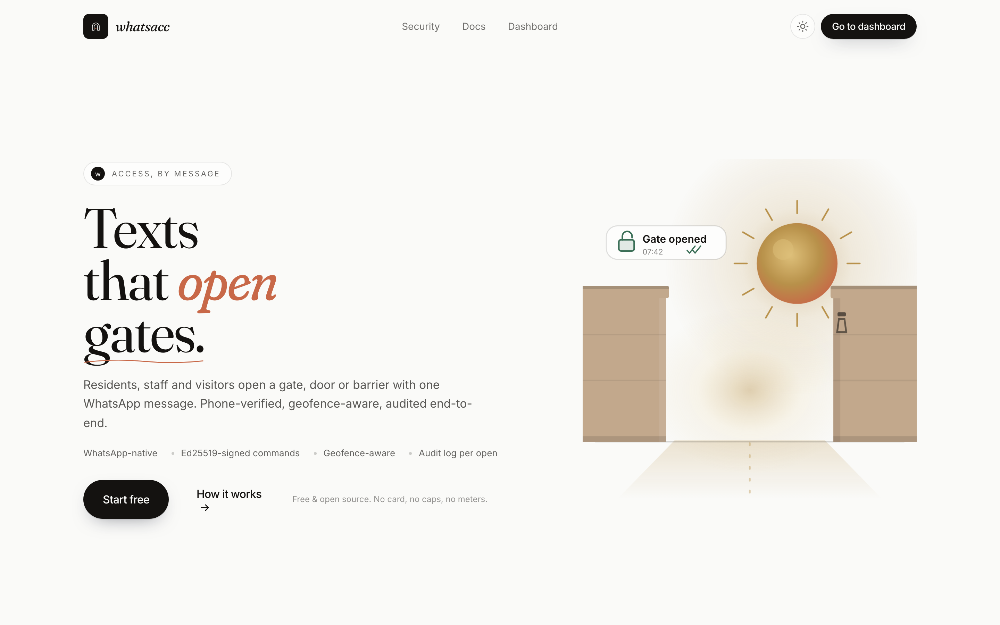
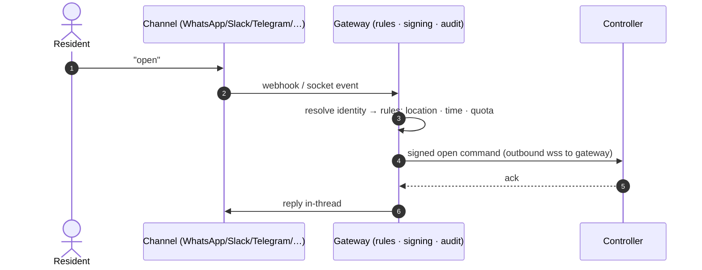

<div align="center">


# lintel

**Self-hosted physical access control.**

Text a chat channel, a gate opens. lintel turns a message on WhatsApp, Slack (incl.
Socket Mode) or Telegram today — Discord next — into an Ed25519-signed command at the
controller guarding your gate, door or barrier, with an offline LAN/BLE path for when
the internet isn't there. Signed, audited, built for trust.

[](LICENSE-MIT)
[](ARCHITECTURE.md)
[](https://vulos.org)


<picture>
  <source media="(prefers-color-scheme: dark)" srcset="site/screenshots/dark/portal-dashboard.png" />
  
</picture>

</div>

---

## What is lintel?

lintel is a decentralized network of independent **gateways**: a gateway is one
MIT-licensed Go binary (SQLite inside, management portal embedded) that anyone can
run — a VPS, a Pi in the guardhouse, anywhere with a public URL. There is **no cloud
center, no hosted service and no billing system** — vulos.org/products/lintel is the
project site, not a cloud. You bring your own WhatsApp number, Slack workspace or
Telegram bot; whichever provider you pick bills you directly (or doesn't) for your own
conversations — never lintel. Operators who want to charge their residents solve that
outside the system.



**The resilience story:** this is designed offline-first from day one, not a fallback
bolted on after the fact — when the app has connectivity the gateway pre-issues it a
short-lived signed grant, which it later proves straight to the controller over LAN or
Bluetooth with no gateway and no Meta involved. **Where that stands today:** the wire
contract ([grants.md](proto/grants.md)) is specified, and **both the controller side and
the gateway's issuance side are real and conformance-tested** — offline-grant
verification, the LAN/mDNS transport, and the BLE framing/challenge-response all run
against [`proto/vectors/`](proto/vectors/) (🟢, see
[controller/README.md](controller/README.md#what-is-real-vs-stubbed)), and the gateway
now mints and signs real `typ:"grant"` objects at `POST /v1/offline-grants`
([`gateway/internal/httpapi/offline_grants.go`](gateway/internal/httpapi/offline_grants.go)),
verified byte-for-byte against the same [`proto/vectors/`](proto/vectors/) fixtures.
What's **not built yet** is the app side (🔨) — nothing on the phone requests, stores or
presents a grant, so the offline path still doesn't run end-to-end for a real resident.
Full design and status in [Emergency access](site/docs/emergency-access.md).

## Features

Three ways in, ranked by how people actually behave:

1. **Chat** — text `open` on whichever channel is already set up: WhatsApp, Slack or
   Telegram today, Discord next. The rules engine checks identity, location, access
   point, active temporary-grant windows and quotas, then pushes an Ed25519-signed
   command to the controller. Multiple access points? You get a numbered picker in
   the thread.
2. **The app** — the admin console, and emergency access designed to work **when the
   internet is down**: a pre-issued signed grant, proved to the controller directly
   over LAN/BLE with a nonce challenge. The controller half and the gateway's
   issuance half are both real and conformance-tested today (see the resilience note
   above) — what's still missing is the app itself requesting, storing and
   presenting a grant, so this isn't something a resident can actually use yet.
3. **Web portal** — unlimited fallback, always.

Plus: per-location daily quotas (owner/admin exempt) and all four rate limits,
one-off dated **temporary access grants** — phone-bound, a single start/end window,
optional use cap, revocable, refunded on a rate-limit/quota denial
(`POST/GET /v1/grants`, portal page) — an append-only audit log, Ed25519-signed
device commands, claim-token controller pairing, and an instance-admin seat for
operators. **Recurring per-location time windows** (a schedule that repeats, e.g.
"cleaner, every Tuesday 08:00–12:00") and one-time PIN/QR passes that don't require
knowing the visitor's number in advance are designed, not started (🔨) — see
[§8 Feature roadmap](ARCHITECTURE.md#8-feature-roadmap) in ARCHITECTURE.md; the
one-off dated grants above already cover the "contractor for one Saturday" case.
**Geofencing** (block opens from outside a radius of the gate) is
designed and documented in [ARCHITECTURE.md](ARCHITECTURE.md) and the security docs,
but — like offline-grant issuance above — **isn't implemented in either the Go
gateway or the reference backend yet** (🔨); treat any geofence description elsewhere
as the design, not shipped behavior, until this line is updated. The full design —
components, security model, wire contracts, hosted-vs-self-hosted economics — lives in
**[ARCHITECTURE.md](ARCHITECTURE.md)**. The wire contracts that controllers and apps
depend on are versioned in [`proto/`](proto/) — see [Wire contracts](#wire-contracts)
below.

**Planned, not shipped:** Discord is next up on the channel list. Further out — a
DMTAP channel (sovereign, keypair-only messaging; no phone number, no chat-provider
account) exists in the gateway only as a fail-closed scaffold: the seam and a
`DMTAPTransport` interface are defined, but the only implementation shipped is one
that always fails closed, so the channel does not run in the shipped binary. See
[`gateway/internal/channels/dmtap.go`](gateway/internal/channels/dmtap.go) for the
honest status note.

## Screenshots

| Access points & controllers | Analytics |
| :---: | :---: |
| <picture><source media="(prefers-color-scheme: dark)" srcset="site/screenshots/dark/portal-locations.png" /></picture> | <picture><source media="(prefers-color-scheme: dark)" srcset="site/screenshots/dark/portal-analytics.png" /></picture> |

| Tap-to-open (mobile) | Landing |
| :---: | :---: |
| <picture><source media="(prefers-color-scheme: dark)" srcset="site/screenshots/dark/app-emergency.png" /></picture> | <picture><source media="(prefers-color-scheme: dark)" srcset="site/screenshots/dark/landing-hero.png" /></picture> |

Every screenshot above is generated, not hand-made — light **and** dark, from the real
app with realistic data:

```bash
npm run screenshotter   # boots the app with mocked data → site/screenshots/{,dark/}
```

## Quick start (standalone)

lintel runs entirely on your own machine — nothing to sign up for, no shared cloud,
no Vulos account required. Prereqs: Node 20+, Postgres 16+ (local).

```bash
git clone https://github.com/vul-os/lintel && cd lintel

npm install                     # frontend deps
cd backend && npm install       # backend deps
cd ..

cp .env.example .env            # read by migrate/seed/test scripts (node --env-file)
cp backend/.dev.vars.example backend/.dev.vars   # read by `wrangler dev` (NOT .env)
# → set DATABASE_URL + JWT_SECRET in BOTH; everything else is optional

cd backend
npm run migrate                 # apply migrations (DATABASE_URL from ../.env)
npm run dev                     # API via wrangler on :8787 (env from .dev.vars)
cd .. && npm run dev            # Vite portal on :5173
```

That's the whole install — no chat channel is required to run the portal and explore
it. Attaching WhatsApp, Slack or Telegram (bring your own number/workspace/bot; the
provider bills you directly, if at all) is covered in
[Run a gateway](site/docs/self-host.md) and [Chat channels](site/docs/channels.md)
once you're ready to open a real gate.

Tests, from `backend/`:

```bash
npm run check                   # tsc
npm run test:unit               # pure unit tests, no DB
npm run test:integration        # real local Postgres — TRUNCATEs tables, use a throwaway DB
npm run test:security           # authz / RLS / webhook-signature suites
npm run test:contract           # opt-in: real Resend test API when keys are set
```

Contract suites skip cleanly without keys — see [`site/docs/`](site/docs/) for details.

## How it works

Everything server-side is **one binary**. The **Go gateway** in `gateway/` is that
binary and now runs the product core — auth, accounts, locations, access points,
controller pairing + the WebSocket device hub, the Ed25519-signed open path, admin
console, rate limits, and the WhatsApp / Slack (Events API + Socket Mode) / Telegram
channels — on one Go binary with one SQLite file. The mature Cloudflare Workers backend
in `backend/` is the behavioural reference it was ported from (and still ahead on a few
deferred surfaces: OTP verify, analytics, OAuth, meters). The gateway receives channel
webhooks, runs the rules, serves the portal and the app's API, holds the audit log, and
pushes signed open commands to controllers. Controllers dial **out** to the gateway, so
they work behind NAT and on CGNAT'd 4G SIMs with zero inbound ports.



The full component breakdown, security model and the "decentralized, not federated"
philosophy are in **[ARCHITECTURE.md](ARCHITECTURE.md)**.

## Wire contracts

Controllers get installed at a gate and stay there for years; lintel's job is to never
break the ones already in the field. Four contracts define everything that crosses the
gateway/controller/app boundary — [pairing](proto/pairing.md), [signed
commands](proto/commands.md), [offline grants](proto/grants.md) and [controller
events](proto/events.md) — and all four are **versioned, additive-only**: a field or
message can be added, nothing can be removed or change meaning within a major version.

Every signed envelope is Ed25519 over canonical JSON (JCS, RFC 8785), so there's no
ambiguity about which bytes got signed. And the spec isn't just prose:
[`proto/vectors/`](proto/vectors/) ships fixed test keys, exact canonical bytes and
accept/reject cases for all four contracts — **68 checks** (`node
proto/vectors/verify.mjs`) that the Go gateway and the reference controller each run
against their own implementation in CI. Disagree with a vector and your implementation
is wrong (or the vector is — fix it there first, then the code).

This matters because the growth path for a physical-access product runs through other
people's controller firmware, not just this repo's. Versioned contracts with
executable conformance vectors are what make "build your own controller" a real
option instead of a request to go read Go source.

**Status: v0 draft.** v1 freezes when the first third-party controller firmware ships
against it. Full conventions in [`proto/README.md`](proto/README.md).

## Configuration

Configuration is environment variables — `.env` / `.env.example` at the repo root for
the current stack, `backend/.dev.vars.example` for the Workers dev server. The Go
gateway's target configuration (data directory, per-channel credentials, rate-limit
tuning, admin claim token) is documented in
[Run a gateway → Configuration](site/docs/self-host.md#configuration).

## Documentation

| Doc | What |
| --- | --- |
| [Getting started](site/docs/getting-started.md) | Fastest path to your first opened gate |
| [Run a gateway](site/docs/self-host.md) | Full self-host walkthrough, install, backup/restore |
| [Ingress & reachability](site/docs/ingress.md) | Which channels need a public URL, and the honest options if yours does |
| [Chat channels](site/docs/channels.md) | WhatsApp, Slack (Events API + Socket Mode), Telegram, Discord (coming) |
| [Controllers](site/docs/controllers.md) | Wiring a gate device |
| [Emergency access](site/docs/emergency-access.md) | The offline LAN/BLE grant path |
| [Architecture](site/docs/architecture.md) · [ARCHITECTURE.md](ARCHITECTURE.md) | Full system design |
| [Security](site/docs/security.md) · [SECURITY.md](SECURITY.md) | Security model + disclosure |
| [API reference](site/docs/api.md) | HTTP surface |

The full set ships in this repo at [`site/docs/`](site/docs/) — `site/` is a plain
static site, host it anywhere; it also syncs into the
[Vulos console](https://vulos.org/products/lintel/docs) as the product mini-site.

## Development

| Directory     | What                                                             | Status |
| ------------- | ---------------------------------------------------------------- | ------ |
| `site/`       | Landing + docs — house mini-site format, self-contained, light/dark | ✅ |
| `proto/`      | Versioned wire contracts + conformance vectors — see [Wire contracts](#wire-contracts) | ✅ v0 draft |
| `backend/`    | Current API — Cloudflare Workers · Postgres RLS · WhatsApp + Slack | ✅ running, **spec for the Go port** |
| `src/`        | Portal application — React 19 · Vite · light/dark, wrapped as a desktop app by `src-tauri/` (Tauri desktop shell, in progress) | ✅ running |
| `scripts/`    | `screenshotter` — Playwright product shots with fixture data     | ✅ |
| `gateway/`    | Go single-binary gateway — SQLite, auth core, admin claim, signed envelopes, offline-grant issuance, WhatsApp/Slack/Telegram channels, admin console | 🟢 runs the product core, including offline-grant issuance (proto/grants.md, `POST /v1/offline-grants`); geofencing not yet built |
| `controller/` | Gate device agent — pairing, key pinning, signed-command verification, offline LAN/BLE grants | 🟢 reference impl real; GPIO relay + BLE radio need real hardware (`-tags gpio` / `-tags ble`) |
| `e2e/`        | Cross-module suite — real gateway + controller binaries over the wire, money path proven | 🟢 |
| `src-tauri/`  | Tauri v2 desktop shell wrapping `src/` — gateway picker (any gateway, not build-time-fixed) | 🟢 |
| `app/`        | A dedicated Svelte 5 rewrite of the app — today's desktop app is `src/` + `src-tauri/` (React 19) instead | 🔨 not started, not needed short-term |

The running Workers stack is the behavioral reference: its routes, tenancy semantics,
chat flows and test suites define what the Go gateway must do. Build/test commands per
directory: see the test block under [Quick start](#quick-start-standalone) for
`backend/`, `cd gateway && make check` (or `go test ./...`) for the Go gateway,
`cd controller && go build ./...` for the controller agent, and `cd e2e && go test ./...`
for the cross-module harness.

Dev setup, test suites and style live in [CONTRIBUTING.md](CONTRIBUTING.md).

## Contributing & security

Small, focused PRs against `main` — see [CONTRIBUTING.md](CONTRIBUTING.md).
Vulnerabilities — this product opens physical gates — go privately via
[SECURITY.md](SECURITY.md), never the public tracker.

## Safety

lintel actuates **physical barriers** — gates, doors, barriers. Get this wrong and the
failure modes hurt people: a gate that doesn't open during a fire, or one that opens
for someone it shouldn't.

**lintel must never be the sole means of egress.** Fire and building codes in most
jurisdictions require code-compliant fail-safe mechanical or electrical release
hardware on egress routes, regardless of what any access-control system does. Install
lintel **in parallel** with that required hardware — it drives a relay the same way a
finger on the existing "open" button would — never **in series** with it, and never as
a replacement for it.

The reference controller is specified fail-safe: the relay driver's contract (see
[`controller/internal/relay/gpio.go`](controller/internal/relay/gpio.go) and
[`controller/README.md#wiring`](controller/README.md#wiring)) requires a normally-open
output line that **must drop — gate mechanism un-actuated — on process exit or
panic**, and the wire protocol only ever sends transient pulse/hold commands, never a
persistent lock (see [Wire contracts](#wire-contracts) above). Be precise about what
that buys you today, though: the `-tags gpio` driver shipped in this repo is a
**documented scaffold that panics, not a hardware-validated implementation** (see
[What is real vs stubbed](controller/README.md#what-is-real-vs-stubbed)) — the default
build drives an in-memory mock relay with no physical output at all. Whoever wires a
real relay board is responsible for implementing (and testing) that fail-safe behavior
on their actual hardware before it guards a real door.

**Operators are responsible** for compliance with local fire, building, safety and
accessibility codes at every installation — lintel has no way to know your
jurisdiction's rules, your building's occupancy, or your gate's mechanical safety
features, and doesn't try to. [LICENSE](LICENSE-MIT)'s MIT warranty disclaimer means
exactly what it says — no warranty, no liability, the software is provided "as is" —
but that disclaimer is not a substitute for correct installation, and it doesn't
transfer your legal duties as the installer to anybody else. If you're deploying this
on a real gate, get your own legal/compliance review before you do; this document
isn't one.

Think something here — including this section — is steering an installation toward an
unsafe outcome? Mail **vulosorg@gmail.com**; see [SECURITY.md](SECURITY.md).

## License

[MIT](LICENSE-MIT) OR [Apache-2.0](LICENSE-APACHE) — © VulOS. lintel is a VulOS
project; source and issues at
[github.com/vul-os/lintel](https://github.com/vul-os/lintel). All of it — gateway,
portal, app, controller agent. No cloud, no billing system, no paid features. Just
the system. Deploying this on a real gate? Read [Safety](#safety) above first, and
see the safety notice appended to [LICENSE-MIT](LICENSE-MIT).

---

<p align="center">
  <a href="https://vulos.org"></a><br>
  <sub><a href="https://vulos.org"><b>vulos</b></a> — open by design</sub>
</p>
