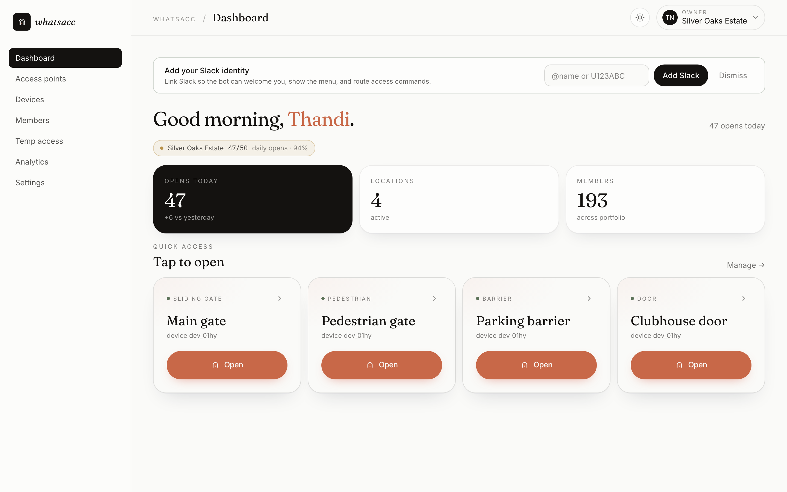
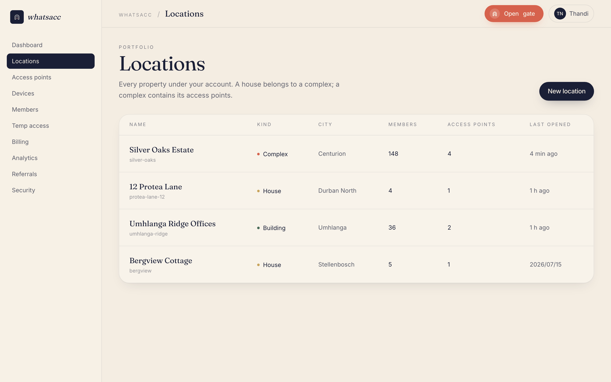
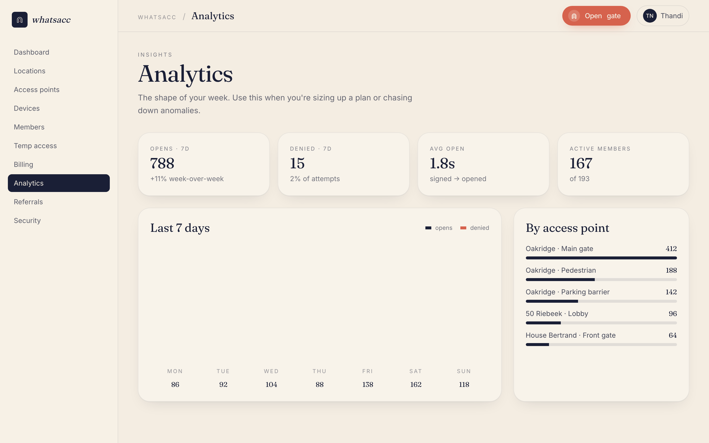
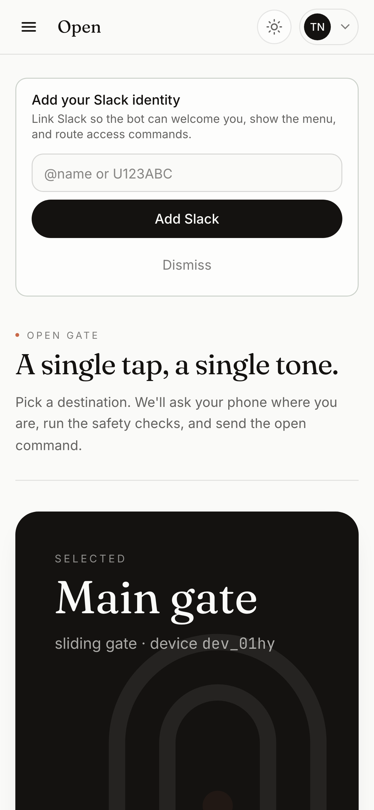
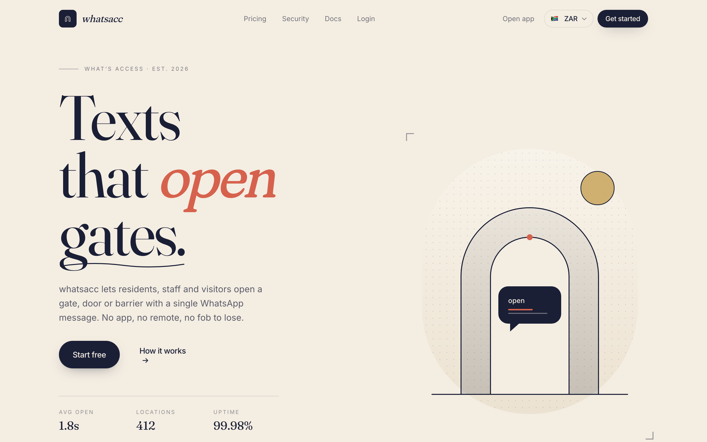
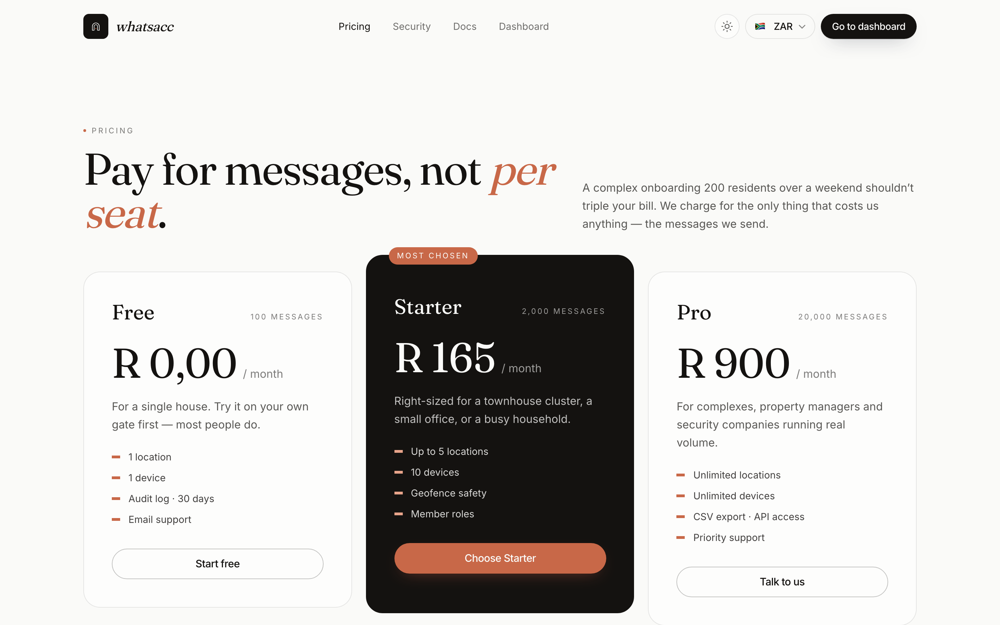

# Screenshots

A visual tour of the portal and the app. Every screen ships in both themes; these
pages follow your theme choice, so the light set is shown here with the dark set
linked alongside.

## The portal

### Dashboard

The first screen after sign-in: live activity across your locations, controller
health, and the day's opens.

[Dark variant](../screenshots/dark/portal-dashboard.png)

### Access points & controllers

Where gates, doors and barriers live — each access point with its paired controller,
online state and rules.

[Dark variant](../screenshots/dark/portal-locations.png)

### Analytics

Opens over time, denials and their reasons, per-member and per-access-point breakdowns
— all derived from the audit log you can also export.

[Dark variant](../screenshots/dark/portal-analytics.png)

## The app

### Emergency access

The screen you hope never to need: internet down, gateway unreachable, the app finds
the controller over LAN or Bluetooth and opens with its offline-verified grant.

[Dark variant](../screenshots/dark/app-emergency.png)

## The website

The landing page and pricing, for the curious:

[Landing dark](../screenshots/dark/landing-hero.png) ·
[Pricing dark](../screenshots/dark/pricing.png)
